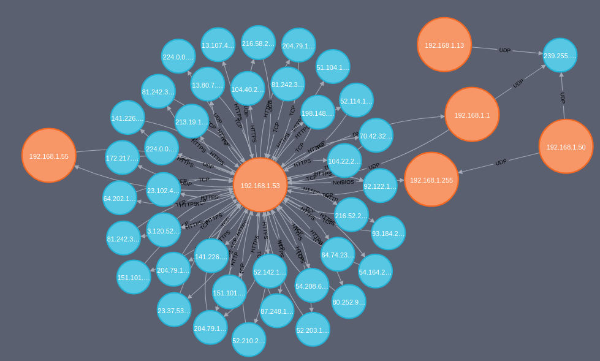

# Netgraph
Create graph with neo4j from pcap

## Exemple:

  

## Command:

    usage: Netgraph.py [options]

    Create graph with neo4j from pcap

    optional arguments:
        -h, --help  show this help message and exit
        -u USER     Username of neo4j database  [DEFAULT: neo4j]
        -p PASSWD   Password of neo4j database  [DEFAULT: neo4j]
        -f FILE     Name of the pcap file       [REQUIRED]
        --url URL   Url of the database         [DEFAULT: bolt://127.0.0.1:7687]